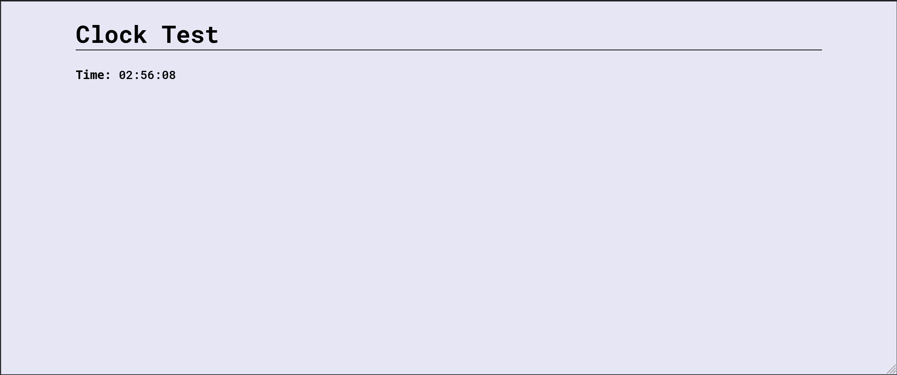

# Sundash

**Python & JS micro framework for realtime web UI applications**

* **ASGI-based** -- minimal 3rd party dependencies and clean core part
* **Flexible and extensible** -- easy to customize, add 3rd party integrations
* **Realtime** -- operating through websockets bus, client & backend in app
* **Crafted with ❤️**

Link to project on PyPi: https://pypi.org/project/sundash/


### Installation

```bash
    pip install sundash
```

### Examples

Check `examples` folder.

Run example (counter with buttons and user interaction):

```bash
    python -m examples counter
```


### Basic example

```python
    import datetime as dt

    from sundash import EVERY_SECOND
    from sundash import App
    from sundash import Component
    from sundash import on
    

    app = App()

    now = lambda: dt.datetime.now().strftime('%H:%M:%S')


    class Clock(Component):
        html = '<p><b>Time: </b>{{ time }}<p/>'

        class Vars:
            # you can pass init values (static or procedural)
            time: str = now

        # run callback when user open webpage
        @on(EVERY_SECOND)
        async def update(self, _):
            await self.set('time', now())  # live update of value

    # add plain HTML or own components
    app.run(layout=('<h1>🕰️ Clock</h1>', Clock))
```




### В чем идея?

Хочу пробрасывать real-time интерфейс к JS либам, чтобы была возможность
написать любую веб-морду для любых системных инструментов.

**Примеры использования:** любые админки, торговые терминалы, дашборды мониторинга, тулзы для аналитики.
Все кастомное и интерактивное, что хочется нарисовать, но ты бэкендер и хочешь писать
преимущественно на Python с минимальным использованием JavaScript-а,
без тяжеловесного инструментария фронтендеров (React и пр).


### Development

* Required: python 3.12, poetry, virtualenv
* Install Python dependencies: `poetry install --with=dev`
* Run local linters: `poe q`
* Publish package: `poetry publish --build`
